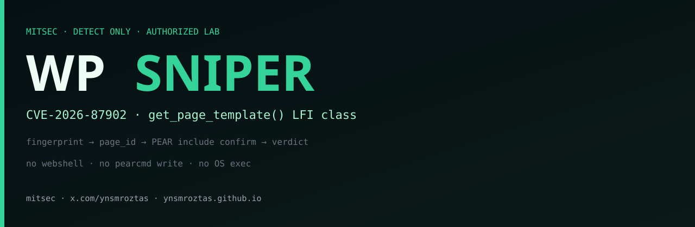
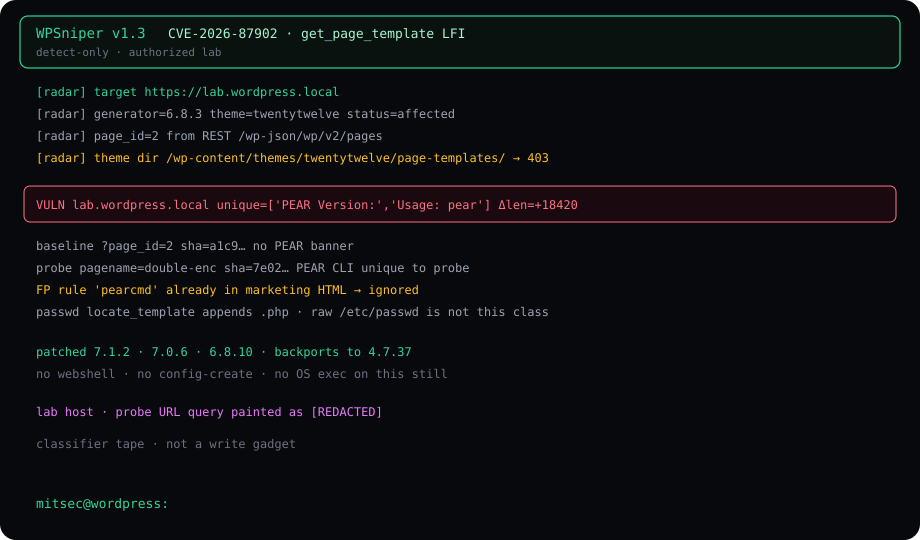
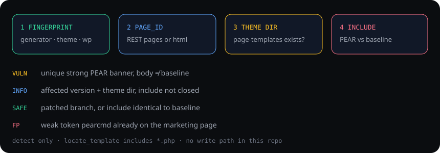

<p align="center">
  
</p>

# WPSniper

**CVE-2026-87902** detector for WordPress Core.

`get_page_template()` can be steered so page-template resolution includes a readable local `.php` file outside the active theme. WPSniper fingerprints the site, picks a published `page_id`, probes the include class, and only prints **VULN** when a strong PEAR banner is unique to the probe body.

Detect only. No webshell. No `pearcmd` `config-create`. No OS command execution.

```
python3 WPSniper.py -u https://lab.wordpress.local --shell
```

Pipeline:

```
subfinder -d lab.example -silent | httpx -silent | python3 WPSniper.py -t 8
```

Written scope. Own lab. That is the whole license to run it.

---

<p align="center">
  
</p>

## Class

WordPress builds the page template name from the URL-derived, url-decoded `pagename` query variable:

`page-{$pagename}.php`

`locate_template()` then includes that file. On affected builds the resolved path is not forced to stay inside an allowed theme directory. A double-encoded traversal in `pagename` survives `sanitize_title` far enough for `get_page_template()` to decode it once and walk out of the theme tree.

Two preconditions sit in front of a closed include:

1. The active parent or child theme has a top-level directory whose name starts with `page-` (WordPress documents `page-templates/` — Twenty Twelve, Twenty Fourteen, Neve, Hestia, Sydney and others).
2. A readable `.php` target exists for the web-server account. The detector uses stock PEAR CLI banners as the include oracle. It does not write one.

RCE is a *possible* follow-on when those conditions plus a writable/executable gadget line up. That follow-on is **not in this repository**.

Finder credit on the CVE: Robert (ressl) via WordPress HackerOne. Advisory: [GHSA-7hp8-65ch-5whp](https://github.com/WordPress/wordpress-develop/security/advisories/GHSA-7hp8-65ch-5whp).

---

<p align="center">
  
</p>

## What the operator does

| Step | Action | Signal |
| --- | --- | --- |
| 1 | Home + generator + `/feed/` | WordPress? version? theme slug? |
| 2 | REST `/wp-json/wp/v2/pages` or `page_id=` in HTML | A published page so the template path actually runs |
| 3 | `GET /wp-content/themes/{slug}/page-templates/` | 200 / 401 / 403 = directory exists |
| 4 | Baseline `?page_id=N` vs probe `pagename=` | Body digest + unique strong PEAR tokens |

Version table is built in. `4.7.0`–`7.1.1` are the affected window. Patched points: `7.1.2`, `7.0.6`, `6.9.9`, `6.8.10` … back to `4.7.37`.

## Confirm rule

A marketing page that says “pearcmd” in a blog post is not a hit.

**VULN** only when all of this is true:

- Probe body digest ≠ baseline `?page_id=` digest
- At least one *strong* token is unique to the probe (`PEAR Version:`, `Usage: pear`, `PEAR_Config`, `Commands for pear`, `config-create`, `DEPRECATED: PEAR commands`, `pear.php`)
- Weak token `pearcmd` / `PEAR` alone is discarded, especially if it already sat in the baseline HTML

**INFO** = affected version and/or `page-templates` directory, include not closed. Do not file critical on INFO.

**SAFE** = patched branch, or include identical to baseline.

**SKIP** = not WordPress, bad URL.

`/etc/passwd` is the wrong oracle for this CVE. `locate_template()` appends `.php`. The interactive `passwd` command exists so you can see that for yourself. A `root:x:0:0:` stanza appearing is unusual and must be verified by hand.

## Install

```
python3 -m pip install -r requirements.txt
python3 WPSniper.py -u https://lab.wordpress.local
```

Requires `requests`.

## Flags

| Flag | Meaning |
| --- | --- |
| `-u URL` | Single target |
| `-l file` | URL list |
| stdin | `subfinder \| httpx \| WPSniper` |
| `-t N` | Threads on a list (default 6) |
| `-q` | Quiet rows + summary |
| `--shell` | Interactive probe on a single `-u` |
| `--timeout` | Seconds (default 14) |

`--shell` is ignored on a pipeline. That is intentional.

## Interactive shell

```
python3 WPSniper.py -u https://lab.wordpress.local --shell
```

```
mitsec@lab.wordpress.local ▶
  1 fp        version / theme / patched?
  2 pages     REST published pages
  3 theme     page-templates directory
  4 probe     PEAR include + baseline diff   (no write)
  5 diff      same, print Δ + tokens
  6 passwd    try …/etc/passwd               (this class includes *.php)
  7 include P include a .php path without suffix
  8 save      last body → /tmp/wpsniper-probe.html
  9 help
  0 exit
```

Every probe prints the full URL and a copy-paste `curl`. Use that in the report. Do not invent a second request.

`7 include` is for an authorized lab file you already placed. Example name in the help text is a witness marker, not a dropper.

## Lab session (redacted)

```
WPSniper v1.3   CVE-2026-87902  get_page_template LFI
[radar] target  https://lab.wordpress.local
[radar] generator=6.8.3  theme=twentytwelve  status=affected
[radar] page_id=2
[radar] theme dir /wp-content/themes/twentytwelve/page-templates/ → 403

VULN  lab.wordpress.local  unique=['PEAR Version:','Usage: pear'] Δlen=+18420

patched  7.1.2 · 7.0.6 · 6.8.10 · backports to 4.7.37
```

Host on this page is a lab label. Live customer hostnames do not belong in a public still.

## Patch

Upgrade to **7.1.2** or the backport for your branch:

`7.0.6` · `6.9.9` · `6.8.10` · `6.7.9` · `6.6.9` · `6.5.12` · `6.4.12` · `6.3.12` · `6.2.13` · `6.1.14` · `6.0.16` · `5.9.18` … down to `4.7.37`.

7.1.2 also requires the resolved template path to stay inside an allowed theme directory. That is the actual fix, not a WAF rule.

## What this repo will not do

- No webshell, no `pearcmd config-create`, no `system()` wrapper
- No mass-scan-the-internet playbook
- No claim that every WordPress 6.x box is RCE
- No raw `/etc/passwd` as the primary confirm

If you need a finding: attach the curl WPSniper already printed, the unique strong tokens, and the baseline digest mismatch.

## Disclaimer

Authorized security testing only. Running this against a host you do not own or do not have in writing is your problem, not the tool's.

## Links

- Site: [ynsmroztas.github.io](https://ynsmroztas.github.io)
- X: [@ynsmroztas](https://x.com/ynsmroztas)
- CVE: [CVE-2026-87902](https://www.cve.org/CVERecord?id=CVE-2026-87902)

mitsec · Yunus Emre Öztaş
